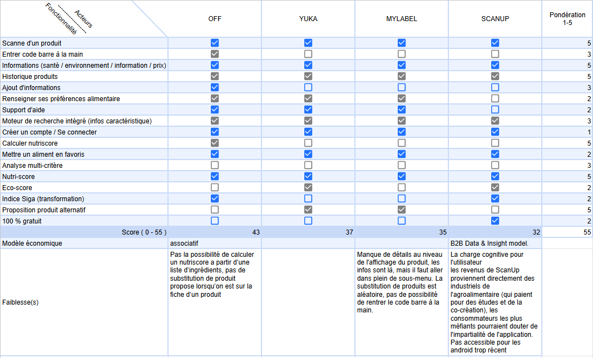
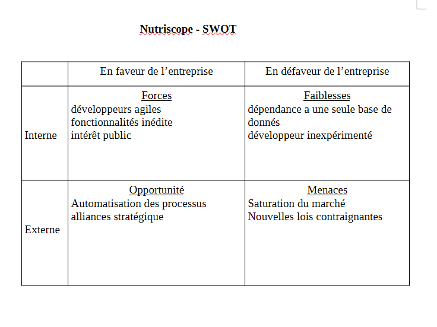

# Benchmark & matrice comparative

## Définir des objectifs et indicateurs clés

> Pondération faites dans le prochain tableau (*).

## Identifier les références à comparer

Yuka, MyLabel, ScanUp, OFF

## Collecter et analyser des données concurrentielles
(*)

## Mettre en œuvre les bonnes pratiques identifiées

# SWOT (Strength, Weakness, Opportunities, Threats)

# Formulation de la proposition de valeur 

> En une phrase testable, puis en un paragraphe : qu'est-ce qu'on fait mieux
ou différemment, pour qui.

- Application des technologies IA, par le biais d'un agent pour une meilleure expérience utilisateur. 
- Cette fonctionnalité est destiné à tous type d'utilisateur.

L'application Nutriscope propose un panel de fonctionnalité variée et maîtrisée, peaufiné avec de l'intelligence artificielle, une expérience de comparatif et de conseils nutritionnel avancés et personnalisé pour chaque utilisateur, afin que chacun voit, dans celle-ci, un réel gain substantiel.
