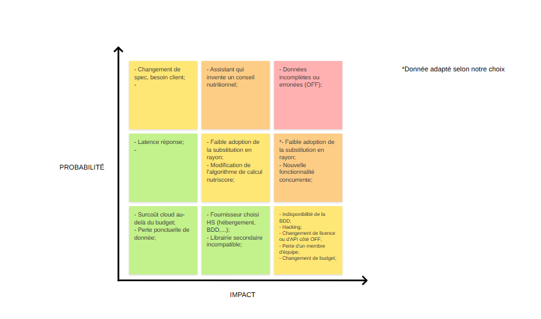

Formule pour estimer la valeur :

Valeur annuelle = volume × gain unitaire × taux de succès attendu
Volume : le nombre d'instances du processus concerné par an (mesuré au jour 1)
Gain unitaire : ce que change une instance réussie — temps gagné, vente conclue,
erreur évitée — converti en euros

Taux de succès : la part des instances où l'IA fera réellement mieux — jamais 100 %

Nombres d'utilisateur estimés : 

# Matrice des risques

Pas d'image ? Texte ici...

<table>
    <caption>Matrice des risques</caption>
    <thead>
        <tr>
            <th></th>
            <th>Impact faible</th>
            <th>Impact moyen</th>
            <th>Impact fort</th>
        </tr>
    </thead>
    <tbody>
        <tr>
            <td><b>Probabilité forte</b></td>
            <td><ul><li>Changement de spec, besoin client;</li></ul></td>
            <td><ul><li>Assistant qui invente un conseil nutritionnel;</li></ul></td>
            <td><ul><li>Données incomplètes ou erronées (OFF);</li></ul></td>
        </tr>
        <tr>
            <td><b>Probabilité moyenne</b></td>
            <td><ul><li>Latence réponse;</li></ul></td>
            <td>
            <ul>
                <li>Faible adoption de la substitution en rayon;</li>
                <li>Modification de l'algorithme de calcul nutriscore;</li>
            </ul></td>
            <td>
            <ul>
                <li>(*)Faible adoption de la substitution en rayon;</li>
                <li>Nouvelle fonctionnalité concurrente;</li>
            </ul></td>
        </tr>
        <tr>
            <td><b>Probabilité faible</b></td>
            <td>
            <ul>
                <li>Surcoût cloud au-delà du budget;</li>
                <li>Perte ponctuelle de donnée;</li>
            </ul></td>
            <td>
            <ul>
                <li>Fournisseur choisi HS (hébergement, BDD,...);</li>
                <li>Librairie secondaire incompatible;</li>
            </ul></td>
            <td>
            <ul>
                <li> Indisponibilité de la BDD;</li>
                <li> Hacking;</li>
                <li> Changement de licence ou d'API côté OFF;</li>
                <li> Perte d'un membre d'équipe;</li>
                <li> Changement de budget;</li>
            </ul></td>
        </tr>
    </tbody>
</table>

(*) Donnée réadapté selon notre point de vue

