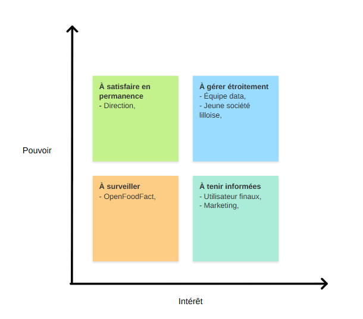
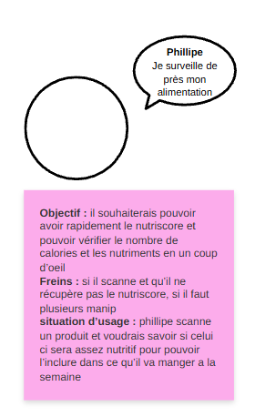
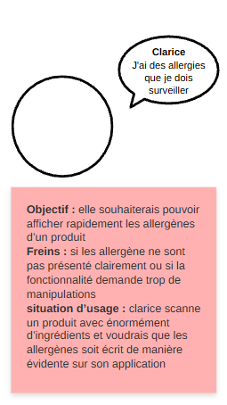
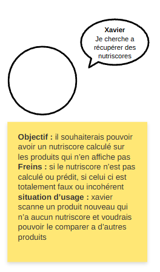

# Introduction

Dans ce documents nous allons établir différents personas, une trame d'entretien et le compte-rendu de celui-ci.

<strong>Objectif</strong> : savoir pour qui on construit NutriScope et qui décide quoi.

# Carte des parties prenantes du projet

> Direction, marketing, équipe data, utilisateurs finaux, Open Food Facts (fournisseur de données), délégué à la protection des données. Pouvoir/intérêt pour chacune — le cadre
réglementaire (RGPD, AI Act) est une contrainte, pas une partie prenante.

# Personas

> <strong>Trois personas utilisateurs, réalistes et différenciés</strong> : par exemple parent pressé en hypermarché, personne
diabétique, étudiant petit budget. Objectifs, freins, situation d'usage.

# Persona 1 - Philipe

Pas d'image ? Texte ici ...

<pre>

<strong>Objectif</strong> : il souhaiterais pouvoir avoir rapidement le nutriscore et pouvoir vérifier le nombre de calories et les nutriments en un coup d’oeil

<strong>Freins</strong> : si il scanne et qu’il ne récupère pas le nutriscore, si il faut plusieurs manip

<strong>Situation d’usage </strong>: phillipe scanne un produit et voudrais savoir si celui ci sera assez nutritif pour pouvoir l’inclure dans ce qu’il va manger a la semaine
</pre>

# Persona 2 - Clarice

Pas d'image ? Texte ici ...

<pre>

<strong>Objectif</strong> : elle souhaiterais pouvoir afficher rapidement les allergènes d’un produit

<strong>Freins</strong> : si les allergène ne sont pas présenté clairement ou si la fonctionnalité demande trop de manipulations

<strong>situation d’usage</strong> : clarice scanne un produit avec énormément d’ingrédients et voudr ais que les allergènes soit écrit de manière évidente sur son application
</pre>

# Persona 3 - Xavier

Pas d'image ? Texte ici ...

<pre>

<strong>Objectif</strong> : il souhaiterais pouvoir avoir un nutriscore calculé sur les produits qui n’en affiche pas

<strong>Freins</strong> : si le nutriscore n’est pas calculé ou prédit, si celui ci est totalement faux ou incohérent

<strong>situation d’usage</strong> : xavier scanne un produit nouveau qui n’a aucun nutriscore et voudrais pouvoir le comparer a d’autres produits
</pre>

# Trame d'entretien

> 10 questions pour valider les besoins.

## Cible

- Souhaitez-vous que l'application s'adresse uniquement aux consommateurs français pour le lancement ?

- Parmi nos différents profils cibles, lequel considérez-vous comme la priorité absolue pour notre lancement ?

- L'application doit-elle être accessible à des personnes n'ayant aucune connaissance préalable en nutrition ?

## Fonctionnalités

- Quels seront les 2 ou 3 indicateurs clés de performance (KPI) qui vous prouveront que la première version est un succès ?

- À quel moment précis de leur journée imaginez-vous nos utilisateurs ouvrir l'application ? (Permet d'avoir des informations sur les fonctionnalités et la charge d'info à l'écran)

- La reconnaissance d'images (scanner un produit sans code-barres) est-elle perçue comme un "gadget" ou une fonctionnalité critique ?

## Organisation 

- Comment souhaitez-vous être informés de l'avancement du projet ? (Fréquence, plateforme, ...)

## Données

- Notre matière première est la base Open Food Facts. Quelle est votre tolérance face aux inévitables données manquantes ou erronées que nous allons rencontrer ? 

- Concernant les données, quel est notre périmètre de récupération ? Sur quels pays ?

- Comment fonctionne-t-on pour la priorité des produits avec un Nutriscore équivalent ? Par quel élément prioriser ?

## Budget (Bonus)

- Pour vous proposer un chiffrage adapté, avez-vous une enveloppe budgétaire en tête, même approximative ?

# Compte-rendu d'entretien

# Mise à jour des personas - après entretien

> Ce qui a été confirmé, infirmé, découvert.
