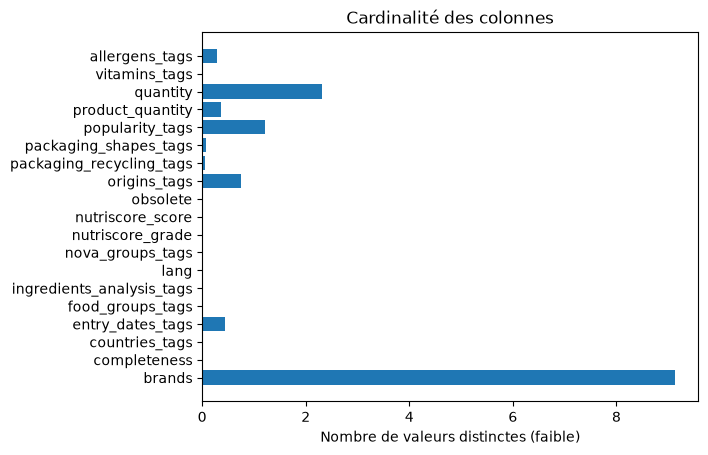
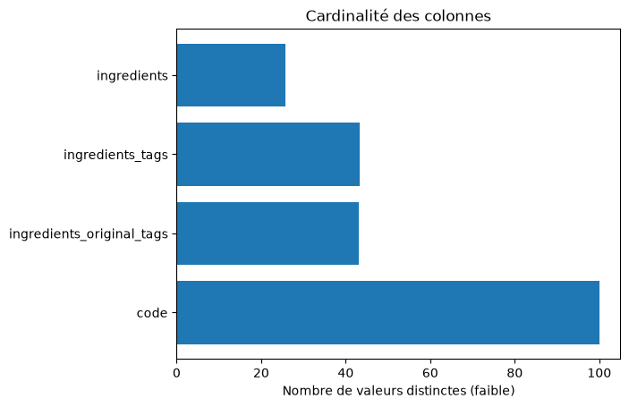

# TP2 - Profiling & périmètre

## Périmètre retenu (avant meeting)
<pre>

[Colonnes retenues]
[Exemple de donnée] 
[Raison du choix / Critère]

<strong>allergens_tags</strong>
[
  "en:nuts"
]
Afin de pouvoir signaler les différents allergènes présent dans le produit

<strong>brands</strong>
Bovetti
Donnée brut, simple texte, importance de connaître la marque. Pour une tracabilité et rassurer la clientèle.

<strong>categories</strong>
Plant-based foods and beverages, Beverages, Hot beverages, Plant-based beverages, Teas, Tea bags
Donnée <strong>très importante</strong>, à compléter pour le calcule du nutriscore

<strong>code</strong>
0000101209159
Donnée brut, simple texte, important pour retrouver la donnée grâce au code-barre

<strong>completeness</strong>
0.7875
Savoir si les informations sont complètes.

<strong>countries_tags</strong>
[
    "en:france"
]
Dans quel pays trouver le produit, pour filtrer c'est important.

Colonne écartée

<strong>data_quality_errors_tags</strong>
[
    "en:nutrition-value-total-over-105","en:energy-value-in-kcal-does-not-match-value-computed-from-other-nutrients"
]
Récupérer les erreurs pour mettre en avant une erreur de complétion

<strong>entry_dates_tags</strong>
[
  "2017-03-09",
  "2017-03",
  "2017"
]
Fonctionne bien avec l'obsolescence des informations, plus pour le côté gestion des données, sans forcément afficher cette info

<strong>food_groups_tags</strong>
[
  "en:beverages",
  "en:unsweetened-beverages"
]

<strong>images</strong>
[
    {
        "key":"1"
        ... (très long)
    }
]
Permet d'afficher une petite image du produit

<strong>ingredients_analysis_tags</strong>
[
  "en:palm-oil-free",
  "en:maybe-vegan",
  "en:vegetarian"
]
Des informations importantes à récupérer pour l'alimentation de chacun

<strong>ingredients_original_tags</strong> Vérifier avec la prochaine colonne
[
  "en:hazelnut",
  "en:cocoa dark chocolate",
  "en:sugar",
  "en:cocoa-paste",
  "en:sugar",
  "en:cocoa-butter",
  "en:vanilla-extract"
]

<strong>ingredients_tags</strong>
[
  "en:hazelnut",
  "en:nut",
  "en:tree-nut",
  "en:cocoa dark chocolate",
  "en:sugar",
  "en:added-sugar",
  "en:disaccharide",
  "en:cocoa-paste",
  "en:plant",
  "en:cocoa",
  "en:cocoa-butter",
  "en:oil-and-fat",
  "en:vegetable-oil-and-fat",
  "en:vegetable-fat",
  "en:vanilla-extract",
  "en:extract",
  "en:vanilla",
  "en:vegetable-extract"
]
Permet d'établir une liste en cas d'alergène

<strong>ingredients_text</strong>
[
  {
    "lang": "main",
    "text": "HAZELNUTS, 73% cocoa dark chocolate (cocoa mass, sugar, cocoa butter, vanilla extract), sugar, rapeseed oil\r\n\r\nMay contain traces of other nuts, milk, and soy."
  },
  {
    "lang": "en",
    "text": "HAZELNUTS, 73% cocoa dark chocolate (cocoa mass, sugar, cocoa butter, vanilla extract), sugar, rapeseed oil\r\n\r\nMay contain traces of other nuts, milk, and soy."
  },
  {
    "lang": "en",
    "text": "HAZELNUTS, 73% cocoa dark chocolate (cocoa mass, sugar, cocoa butter, vanilla extract), sugar, rapeseed oil\r\n\r\nMay contain traces of other nuts, milk, and soy."
  }
]
Permet d'établir une liste en cas d'alergène en récupérant le span .allergen

<strong>ingredients</strong>
Donnée trop longue...
À récupérer à la place des trois précédentes, mais possède énormément de keys et values.

<strong>lang</strong>
fr
Permet de filtrer par langue

<strong>nova_groups_tags</strong>
[
  "en:3-processed-foods" (ultra, unprocessed, processed-minimaly etc...)
]
Savoir si l'aliment est transformé ou non, 

Colonne écartée

<strong>nutrient_levels_tags</strong>
[
  "en:fat-in-high-quantity",
  "en:saturated-fat-in-high-quantity",
  "en:sugars-in-high-quantity",
  "en:salt-in-low-quantity"
]

<strong>nutriments</strong>
[
  {
    "name": "saturated-fat",
    "value": null,
    "100g": 10, À vérifier
    "serving": null,
    "unit": "g", À vérifier
    "prepared_value": null,
    "prepared_100g": null,
    "prepared_serving": null,
    "prepared_unit": null
  }, 
  ...
]

<strong>nutriscore_grade</strong>
e
Grade du nutriscore, pas besoin d'argumenté

<strong>nutriscore_score</strong>
25
Nutriscore, pas besoin d'argumenté

<strong>obsolete</strong>
false / true
Nous permet de filtrer directement les produits obsolètes.

<strong>origins_tags</strong> Vérifier l'info
...

<strong>packaging_recycling_tags</strong> Selon la décision du client
[
  "en:recycle-in-sorting-bin"
]
eco responsable

<strong>packaging_shapes_tags</strong> Selon la décision du client
[
  "en:jar",
  "en:lid"
]
Rappel de comment trier le packaging

<strong>popularity_tags</strong> Selon la décision du client
[
  "top-75-percent-scans-2024",
  "top-80-percent-scans-2024",
  "top-85-percent-scans-2024",
  "top-90-percent-scans-2024",
  "top-1000-sg-scans-2024",
  "top-5000-sg-scans-2024",
  "top-10000-sg-scans-2024",
  "top-50000-sg-scans-2024",
  "top-100000-sg-scans-2024",
  "top-country-sg-scans-2024",
  "top-75-percent-scans-2025",
  "top-80-percent-scans-2025",
  "top-85-percent-scans-2025",
  "top-90-percent-scans-2025",
  "top-50000-gb-scans-2025",
  "top-100000-gb-scans-2025",
  "top-country-gb-scans-2025"
]

<strong>product_name</strong>
[
  {
    "lang": "main",
    "text": "Véritable pâte à tartiner noisettes chocolat noir"
  },
  {
    "lang": "fr",
    "text": "Véritable pâte à tartiner noisettes chocolat noir"
  }
]
Le nom de notre produit c'est important.

<strong>product_quantity</strong>
350

<strong>product_quantity_unit</strong>
g

Colonne écartée

<strong>quantity</strong>
350 g
Hésitation avec la quantité et la quantité du produit, celle-ci a le "g" et l'autre non.
Les deux peuvent être complémentaire.

<strong>states_tags</strong>
[
  "en:to-be-completed",
  "en:nutrition-facts-completed",
  "en:ingredients-completed",
  "en:expiration-date-completed",
  "en:packaging-code-to-be-completed",
  "en:characteristics-to-be-completed",
  "en:origins-to-be-completed",
  "en:categories-completed",
  "en:brands-completed",
  "en:packaging-to-be-completed",
  "en:quantity-completed",
  "en:product-name-completed",
  "en:photos-to-be-validated",
  "en:packaging-photo-to-be-selected",
  "en:nutrition-photo-selected",
  "en:ingredients-photo-selected",
  "en:front-photo-selected",
  "en:photos-uploaded"
]
Permet d'identifier les cases manquantes d'un produits assez rapidement.

<strong>vitamins_tags</strong> Vérifier si l'info n'est pas ailleurs UPDATE : info dans ingredients_tags, MAIS pas les même vitamines, problème de cohérence des informations
[
  "en:vitamin-e",
  "en:dl-alpha-tocopheryl-acetate",
  "en:retinyl-palmitate",
  "en:cholecalciferol"
]
Un plus
</pre>

## Ce qu'on écarte et pourquoi

<pre>

[Colonnes écartées]
[Pourquoi]

<strong>Filtre après meeting :</strong>
['data-quality-errors-tags','nutrient_levels_tags', quantity]
Écartées après un premier meeting pour cause que les données présentées peuvent être calculées par nos soins au lieu de faire confiance à l'entrée ou la récupération de ces données.

<strong>Information non pertinente :</strong>
[exemple : 'created_t', 'creator', 'last_editor', ...]
Pas nécessaire de garder ces colonnes pour connaître qui a ajouté ce produit ou l'a édité.

<strong>Doublons :</strong>
['countries', 'countries_tags']
Ce genre d'exemple, nous avons préféré prendre seulement une sur les deux, car cela faisait énormément de redondances dans les données
</pre>

## Décision de périmètre

### Rayons couverts au lancement & colonnes concervées

#### Vitamines
<pre>
vitamin-a
vitamin-b1
vitamin-b2
vitamin-b6
vitamin-b9
vitamin-b12
vitamin-c
vitamin-d
vitamin-e
vitamin-k
vitamin-pp
vitamine-h
</pre>
#### Énergie
<pre>
energy
energy-kj
energy-kcal
</pre>
#### Valeur nutritionnelle
<pre>
fat
saturated-fat
carbohydrates
sugars
fiber
proteins
salt
sodium
cholesterol
</pre>
#### Minéraux
<pre>
calcium
iron
magnesium
potassium
zinc
</pre>
#### Oméga
<pre>
omega-3-fat
omega-6-fat
omega-9-fat
</pre>
#### Écologie - Recyclage
<pre>
packaging_recycling_tags
packaging_shapes_tags
</pre>
#### Autres...
<pre>
caffeine
alcohol
water
</pre>

### Seuil de complétude minimal par produit
<pre>
Minimum : 0.0
Maximum : 1.1 (?)
Moyenne : 0.4133
Médiane : 0.375

Ce qui veut dire que l'on doit choisir un seuil assez bas, pour éviter de supprimer 50% des données rentrées.
</pre>

# Profiling des colonnes

## brands

> **Note :** Les marques les plus représentées dans la liste
- **Cardinalité :** 113784

| Valeur | Distribution |
|---|---:|
|  | 7.76 % |
| Carrefour | 1.71 % |
| U | 1.70 % |
| Auchan | 0.89 % |
| Leader Price | 0.77 % |

## code

> **Note :** Cohérent, hors doublons, il y a bien un code bar par produit
- **Cardinalité :** 1247309

| Valeur | Distribution |
|---|---:|
| 0059527070430 | 0.00 % |
| 0059527171687 | 0.00 % |
| 0059527401555 | 0.00 % |
| 0059527501552 | 0.00 % |
| 0059527601559 | 0.00 % |

## completeness

> **Note :** Utile pour déterminer le taux de complétion d’un produit, mais la « cardinalité » n’a que peu de sens pour cette donnée.
- **Cardinalité :** 64

| Valeur | Distribution |
|---|---:|
| 0.2750000059604645 | 13.23 % |
| 0.375 | 12.17 % |
| 0.4749999940395355 | 8.70 % |
| 0.16249999403953552 | 5.62 % |
| 0.574999988079071 | 4.88 % |

## countries_tags

- **Cardinalité :** 240

| Valeur | Distribution |
|---|---:|
| en:france | 89.41 % |
| en:germany | 2.14 % |
| en:spain | 1.18 % |
| en:belgium | 1.08 % |
| en:italy | 1.02 % |

## entry_dates_tags

- **Cardinalité :** 5425

| Valeur | Distribution |
|---|---:|
| 2018 | 7.33 % |
| 2019 | 4.22 % |
| 2020 | 3.12 % |
| 2025 | 3.06 % |
| 2021 | 2.98 % |

## food_groups_tags

- **Cardinalité :** 56

| Valeur | Distribution |
|---|---:|
| en:sugary-snacks | 10.21 % |
| en:fish-meat-eggs | 8.69 % |
| en:milk-and-dairy-products | 5.58 % |
| en:cereals-and-potatoes | 5.06 % |
| en:sweets | 4.45 % |

## ingredients_analysis_tags

- **Cardinalité :** 12

| Valeur | Distribution |
|---|---:|
| en:palm-oil-free | 22.69 % |
| en:non-vegan | 15.52 % |
| en:vegetarian-status-unknown | 12.48 % |
| en:vegetarian | 10.79 % |
| en:vegan-status-unknown | 8.10 % |

## ingredients_original_tags

- **Cardinalité :** 538493

| Valeur | Distribution |
|---|---:|
| en:salt | 4.38 % |
| en:sugar | 3.38 % |
| en:water | 3.16 % |
| en:wheat-flour | 1.38 % |
| en:emulsifier | 1.27 % |

## ingredients_tags

- **Cardinalité :** 539051

| Valeur | Distribution |
|---|---:|
| en:salt | 2.09 % |
| en:added-sugar | 2.07 % |
| en:disaccharide | 1.79 % |
| en:sugar | 1.75 % |
| en:oil-and-fat | 1.48 % |

## ingredients_text.lang

- **Cardinalité des valeurs extraites :** 85
- **Type :** sous-colonne issue d'une structure imbriquée

| Valeur | Distribution |
|---|---:|
| fr | 51.72 % |
| main | 29.39 % |
| en | 8.83 % |
| de | 2.89 % |
| it | 1.81 % |

## ingredients_text.text

- **Cardinalité des valeurs extraites :** 617995
- **Type :** sous-colonne issue d'une structure imbriquée

| Valeur | Distribution |
|---|---:|
| Poulet | 0.16 % |
| Bœuf | 0.09 % |
| Miel | 0.08 % |
| Porc | 0.06 % |
| Dinde | 0.05 % |

### ingredients

> **Note :** colonne contenant une structure JSON imbriquée sérialisée sous forme de chaîne de caractères.  
> Cardinalité et distribution non calculées dans ce profiling ; un traitement spécifique est nécessaire.

## lang

- **Cardinalité :** 81

| Valeur | Distribution |
|---|---:|
| fr | 84.84 % |
| en | 11.89 % |
| de | 1.44 % |
| it | 0.68 % |
| es | 0.48 % |

## nova_groups_tags

- **Cardinalité :** 6

| Valeur | Distribution |
|---|---:|
| unknown | 72.70 % |
| en:4-ultra-processed-food-and-drink-products | 15.71 % |
| en:3-processed-foods | 5.81 % |
| en:1-unprocessed-or-minimally-processed-foods | 3.60 % |
| en:2-processed-culinary-ingredients | 2.16 % |

## nutriments.name

- **Cardinalité des valeurs extraites :** 170
- **Type :** sous-colonne issue d'une structure imbriquée

| Valeur | Distribution |
|---|---:|
| energy | 5.99 % |
| energy-kcal | 5.99 % |
| proteins | 5.95 % |
| carbohydrates | 5.94 % |
| fat | 5.94 % |

## nutriments.prepared_unit

- **Cardinalité des valeurs extraites :** 6
- **Type :** sous-colonne issue d'une structure imbriquée

| Valeur | Distribution |
|---|---:|
| g | 73.82 % |
| kJ | 17.16 % |
| kcal | 8.55 % |
| % | 0.28 % |
| % vol | 0.19 % |

> **Note :** Les données suivantes sont associées à chaque name et ne sont donc pas représentatives d’une distribution globale des valeurs.

## nutriments.value
## nutriments.100g

## nutriscore_grade

- **Cardinalité :** 7

| Valeur | Distribution |
|---|---:|
| unknown | 58.71 % |
| e | 10.81 % |
| d | 10.02 % |
| c | 7.89 % |
| a | 5.16 % |

## nutriscore_score

- **Cardinalité :** 70

| Valeur | Distribution |
|---|---:|
| 0.0 | 5.47 % |
| 4.0 | 4.05 % |
| 19.0 | 4.01 % |
| 12.0 | 3.90 % |
| 3.0 | 3.76 % |

## obsolete

- **Cardinalité :** 1

| Valeur | Distribution |
|---|---:|
| False | 100.00 % |

## origins_tags

- **Cardinalité :** 9282

| Valeur | Distribution |
|---|---:|
| en:france | 37.01 % |
| en:european-union | 5.14 % |
| en:italy | 4.11 % |
| en:spain | 2.83 % |
| en:european-union-and-non-european-union | 1.33 % |

## packaging_recycling_tags

- **Cardinalité :** 567

| Valeur | Distribution |
|---|---:|
| en:recycle | 44.75 % |
| en:recycle-in-sorting-bin | 21.10 % |
| en:discard | 18.38 % |
| en:recycle-in-glass-bin | 5.23 % |
| en:recycle-with-plastics | 2.51 % |

## packaging_shapes_tags

- **Cardinalité :** 820

| Valeur | Distribution |
|---|---:|
| en:bag | 17.78 % |
| en:bottle | 9.13 % |
| en:tray | 8.79 % |
| en:box | 8.43 % |
| en:film | 7.62 % |

## popularity_tags

- **Cardinalité :** 15021

| Valeur | Distribution |
|---|---:|
| top-90-percent-scans-2020 | 1.65 % |
| top-90-percent-scans-2019 | 1.61 % |
| top-75-percent-scans-2025 | 1.59 % |
| top-80-percent-scans-2025 | 1.59 % |
| top-85-percent-scans-2025 | 1.59 % |

## product_name.lang

- **Cardinalité des valeurs extraites :** 113
- **Type :** sous-colonne issue d'une structure imbriquée

| Valeur | Distribution |
|---|---:|
| main | 47.20 % |
| fr | 45.26 % |
| en | 3.81 % |
| de | 1.30 % |
| es | 0.70 % |

## product_name.text

- **Cardinalité des valeurs extraites :** 800085
- **Type :** sous-colonne issue d'une structure imbriquée

| Valeur | Distribution |
|---|---:|
| Miel | 0.10 % |
| Filet de poulet | 0.10 % |
| Comté | 0.10 % |
| Chocolat | 0.09 % |
| Poulet | 0.08 % |

## product_quantity

- **Cardinalité :** 4429

| Valeur | Distribution |
|---|---:|
| 500 | 6.11 % |
| 250 | 5.21 % |
| 1000 | 4.59 % |
| 200 | 4.49 % |
| 100 | 3.54 % |

## quantity

- **Cardinalité :** 28870

| Valeur | Distribution |
|---|---:|
|  | 21.12 % |
| 500 g | 3.65 % |
| 250 g | 3.30 % |
| 200 g | 3.06 % |
| 100 g | 2.60 % |

## vitamins_tags

- **Cardinalité :** 50

| Valeur | Distribution |
|---|---:|
| en:vitamin-d | 10.99 % |
| en:niacin | 10.05 % |
| en:thiamin | 9.52 % |
| en:vitamin-b6 | 7.68 % |
| en:vitamin-c | 7.54 % |

## allergens_tags

- **Cardinalité :** 3595

| Valeur | Distribution |
|---|---:|
| en:milk | 26.81 % |
| en:gluten | 22.80 % |
| en:eggs | 10.77 % |
| en:soybeans | 9.92 % |
| en:nuts | 7.07 % |

